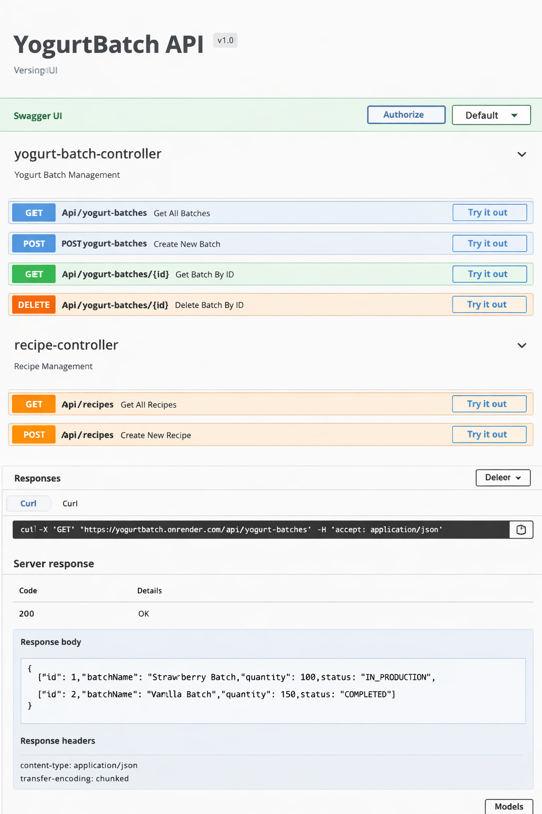

# YogurtBatch API

YogurtBatch es una API REST desarrollada con Spring Boot que permite gestionar el proceso de producción de yogurt por lotes. Incluye operaciones CRUD, persistencia con JPA y base de datos H2, además de documentación interactiva mediante Swagger (OpenAPI).

---

## Tecnologías

- Java 21
- Spring Boot
- Spring Data JPA
- H2 Database
- Maven
- Swagger (OpenAPI)
- Docker
- Render (deploy)

---

## Ejecución del proyecto

### Clonar repositorio
git clone https://github.com/Criss834/YogurtBatch.git

### Entrar al proyecto
cd YogurtBatch

### Ejecutar con Maven
mvn spring-boot:run

---

## API desplegada

Puedes acceder a la API en:

https://yogurtbatch.onrender.com

### Swagger

https://yogurtbatch.onrender.com/swagger-ui/index.html

---

## Endpoints principales

- GET /api/yogurt-batches
- POST /api/yogurt-batches
- GET /api/recipes
- POST /api/recipes

---

## Base de datos

El proyecto utiliza H2 Database en memoria para almacenamiento de datos.

Acceso a consola H2:

http://localhost:8080/h2-console

---

## Docker

El proyecto está configurado con Docker para facilitar su despliegue.

### Construir imagen
docker build -t yogurtbatch .

### Ejecutar contenedor
docker run -p 8080:8080 yogurtbatch

---

## Evidencias

Las evidencias del funcionamiento del sistema se encuentran en la carpeta:

docs/evidencias

Incluyen:
- Funcionamiento en Swagger
- Deploy en Render
- Pruebas de endpoints

---

## Autor

Cristian Danilo Quintero Montoya
Estudiante de Desarrollo de Software

---

## Licencia

Este proyecto está bajo la licencia MIT.

## Evidencias

